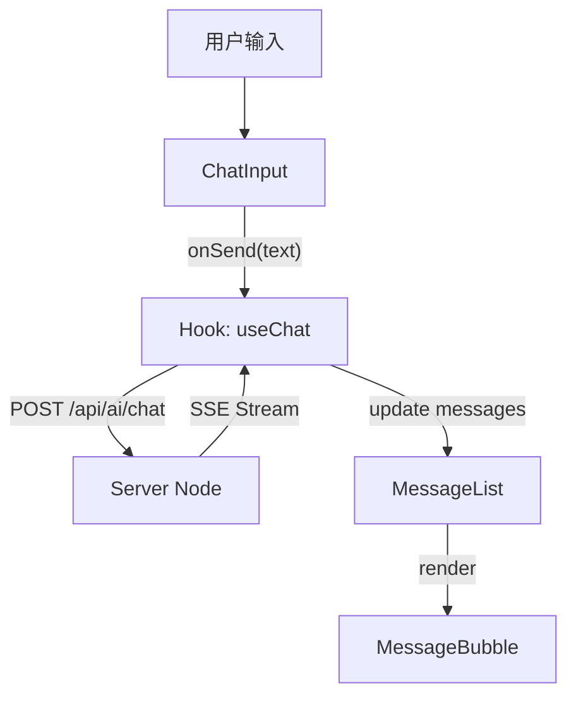

# Phase 3: AI Chat 前端架构设计方案

## 1. 设计目标
本设计旨在为 Web 端引入一个轻量、高效且可复用的 AI 对话能力。核心关注点包括：
- **流式响应 (Streaming)**: 实现类似 ChatGPT 的打字机效果。
- **业务逻辑解耦**: 将 SSE 连接、状态管理、消息存储与 UI 组件分离。
- **用户体验**: 提供非阻塞式的悬浮交互，不打断用户当前的浏览行为。

## 2. 架构分层设计

### 2.1 业务逻辑层 (Business Logic Layer)
> 位于 `apps/web-react/src/hooks/useChat.ts` (未来可下沉至 `business-core`)

负责处理核心对话逻辑，不依赖具体 UI。

- **状态管理**:
  - `messages`: 消息列表 `[{ role, content, status }]`。
  - `isStreaming`: 是否正在生成中。
  - `sessionUuid`: 当前会话 ID。
- **核心方法**:
  - `sendMessage(text)`: 发送消息并处理流式响应。
  - `abort()`: 中断当前生成。
  - `resetSession()`: 开启新对话。
- **流式处理**:
  - 封装 `fetch` + `ReadableStream` 或 `EventSource`。
  - 解析后端 SSE 格式数据 (`data: {...}`)。

### 2.2 UI 展示层 (UI Layer)
> 位于 `apps/web-react/src/components/Chat`

采用 **Floating Action Button (FAB) + Drawer/Popover** 的形态。

#### 组件拆分
1.  **ChatWidget (入口组件)**
    - 悬浮按钮 (Floating Button)。
    - 负责挂载 `ChatWindow`。
    - 维护窗口的展开/折叠状态。
2.  **ChatWindow (主窗口)**
    - 包含 Header (标题/关闭/重置)。
    - 包含 `MessageList` (滚动区域)。
    - 包含 `ChatInput` (输入框/发送按钮)。
3.  **MessageList (消息流)**
    - 负责渲染 `user` 和 `assistant` 的消息气泡。
    - 处理自动滚动到底部 (Auto-scroll)。
4.  **MessageBubble (单条消息)**
    - 支持 Markdown 渲染 (使用 `react-markdown`)。
    - 支持光标闪烁动画 (Cursor Blinking)。

## 3. 数据流向图 (Data Flow)



## 4. 关键技术点

### 4.1 SSE 解析器实现
由于浏览器原生的 `EventSource` 只支持 GET 请求，而我们的 Chat 接口是 POST (需要传 JSON Body)。
因此，我们需要基于 `fetch` 实现一个简单的 SSE 读取器：

```typescript
const response = await fetch('/api/ai/chat', { ... });
const reader = response.body.getReader();
const decoder = new TextDecoder();

while (true) {
  const { done, value } = await reader.read();
  if (done) break;
  const chunk = decoder.decode(value);
  // 解析 "data: {...}" 格式
  parseSSEChunk(chunk, onMessage);
}
```

### 4.2 消息状态机
每条消息有三种状态，用于 UI 准确反馈：
- `sending`: 发送中 (用户消息刚发出，未收到服务器确认)。
- `streaming`: 接收中 (AI 正在打字)。
- `done`: 完成 (AI 回复完毕或出错)。

## 5. 目录结构规划

```bash
apps/web-react/src/
├── components/
│   └── Chat/
│       ├── index.tsx           # 导出入口 (ChatWidget)
│       ├── ChatWidget.tsx      # 悬浮按钮逻辑
│       ├── ChatWindow.tsx      # 对话框容器
│       ├── MessageList.tsx     # 消息列表
│       ├── MessageBubble.tsx   # 消息气泡 (Markdown)
│       └── ChatInput.tsx       # 输入框
│
└── hooks/
    └── useChat.ts              # 核心业务逻辑 Hook
```
œ
## 6. 依赖库选型 (Updated)
- **UI 组件库**: `@ant-design/x` (Bubble, Sender, etc.)
- **Markdown 渲染**: `@ant-design/x-markdown` (内置流式优化)
- **图标**: `@ant-design/icons`

