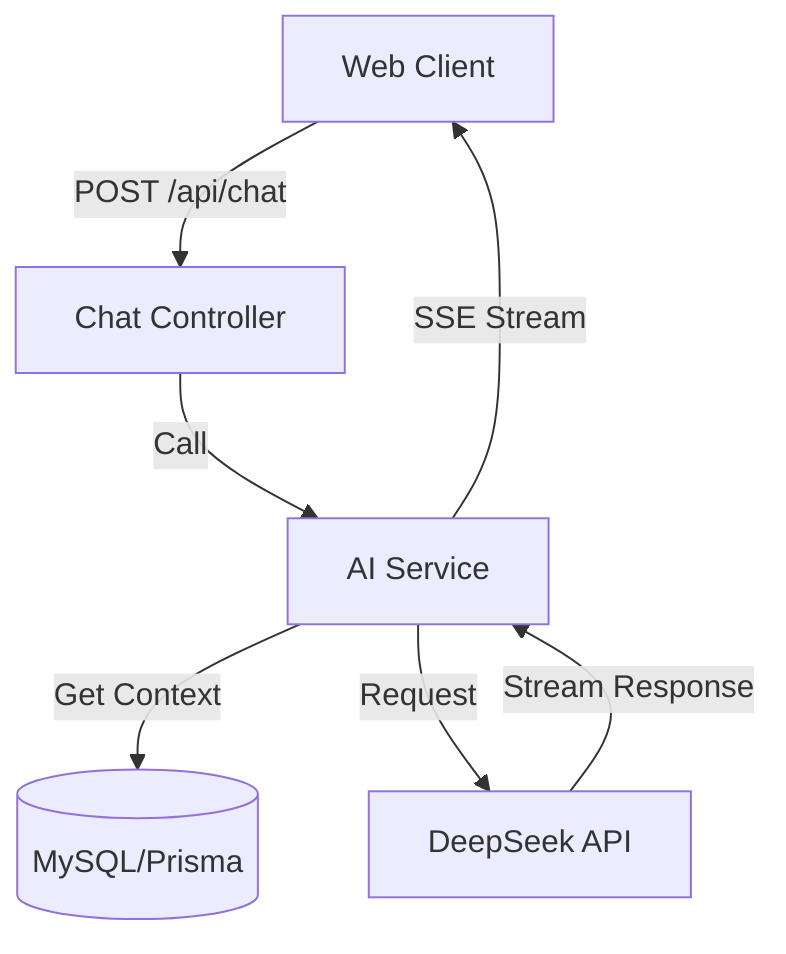

# Phase 3: AI 接入与智能化集成规划

## 1. 阶段目标
本阶段旨在将 AI 能力（以 DeepSeek/OpenAI 为主）集成到现有系统中，实现从"传统 CRUD 应用"向"智能化应用"的转型。核心目标包括：
- **基础能力**：打通 LLM API，封装统一的 AI Service。
- **数据增强**：利用数据库中的现有数据（News, Banner 等）作为 Context，增强 AI 回答的准确性（RAG 初探）。
- **交互创新**：在前端实现流式对话（Streaming）体验。

## 2. 技术架构

### 2.1 核心组件
- **LLM Provider**: DeepSeek (兼容 OpenAI SDK) 或 OpenAI。
- **SDK**: `openai` (Node.js 官方库)。
- **Context Management**: 
  - **短期记忆**: 内存或 Redis (对话 Session)。
  - **长期记忆**: MySQL (历史对话记录 `ChatHistory` 表)。
- **Stream Handling**: Server-Sent Events (SSE) 或 WebSocket（本项目优先使用 SSE 保持轻量）。

### 2.2 架构变更


## 3. 实施步骤

### Step 1: 基础设施准备 (Infrastructure)
- [ ] 申请 API Key (DeepSeek/OpenAI)。 
- [ ] 配置环境变量 (`AI_API_KEY`, `AI_BASE_URL`, `AI_MODEL_NAME`)。
- [ ] 安装依赖: `pnpm add openai`。

### Step 2: 后端服务开发 (Backend)
- [ ] **Schema 变更**:
  - 新增 `ChatSession` 和 `ChatMessage` 表，用于存储对话历史。
  - 运行 Migration。
- [ ] **AI Service 封装**:
  - 实现 `chat(message: string, context?: any)` 方法。
  - 封装 Prompt Template（提示词模板）。
- [ ] **Controller 开发**:
  - 实现 `/api/ai/chat` 接口（支持流式输出）。
  - 集成全局错误处理。

### Step 3: 业务场景落地 (Business Logic)
- [ ] **场景一：智能问答 (Q&A)**
  - **策略**: Context Injection (基于规则的上下文注入)。
  - **实现**: 用户询问 News 时，Service 自动查询 `News` 表最近 5 条记录拼接进 System Prompt，而非引入复杂的向量数据库 (Vector DB)。
- [ ] **场景二：模拟面试官 (Mock Interviewer)**
  - 基于用户的简历（可预设文本），进行模拟面试对话。

### Step 4: 前端对接 (Frontend)
- [ ] 封装 SSE 请求工具函数 (处理断连、重试)。
- [ ] 开发 ChatUI 组件（输入框、消息列表、打字机效果）。

## 4. 数据库设计预案 (Schema Preview)

```prisma
// 新增模型预览
model ChatSession {
  id        Int           @id @default(autoincrement())
  uuid      String        @unique @default(uuid())
  title     String?
  createdAt DateTime      @default(now())
  updatedAt DateTime      @updatedAt
  messages  ChatMessage[]
}

model ChatMessage {
  id        Int         @id @default(autoincrement())
  role      String      // "user" | "assistant" | "system"
  content   String      @db.Text
  tokenCount Int?       // 新增：记录 Token 消耗
  sessionId Int
  session   ChatSession @relation(fields: [sessionId], references: [id])
  createdAt DateTime    @default(now())
}
```

## 5. 风险评估与对策
- **成本控制**: 
  - 增加 `tokenCount` 字段记录消耗。
  - **缺少流控**: 需在 Nginx 或 Node 层增加 Rate Limit，防止接口被刷导致 API Key 欠费。
- **响应延迟**: 强制使用流式传输 (Streaming) 优化首字时间 (TTFB)。
- **Prompt 注入**: 在 Service 层增加输入清洗和 System Prompt 约束。
- **技术复杂度 (RAG)**: 
  - 风险: MySQL 对向量搜索支持有限。
  - 对策: Phase 3.0 暂不引入向量库，采用 "Prompt Context Injection" (查库 -> 拼 Prompt) 的轻量化方案。
